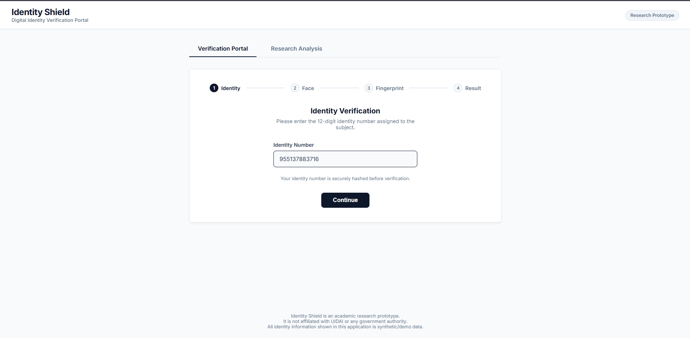
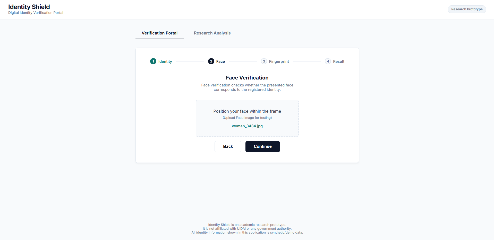
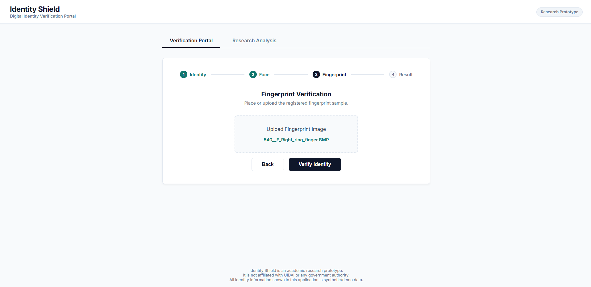
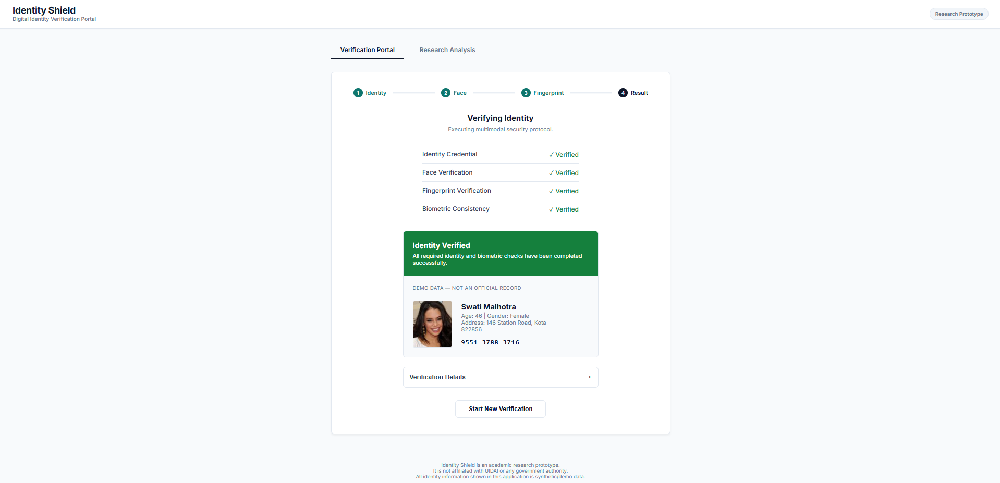

# Identity Shield — Multi-Layer Defense Framework

**Identity Shield** is an Aadhaar-inspired research prototype designed to defend against biometric identity impersonation. It implements a sequential **5-Gate Hard-Security Framework** that stops synthetic identities, face spoofing (presentation attacks), deepfakes, and fingerprint spoofing.

> **Disclaimer:** This is an academic research prototype built for educational and security research purposes. It is **not** affiliated with UIDAI or any government authority. All identity data used in this project is purely synthetic.

---

## 🛡️ Architecture: The 5-Gate Pipeline

Every authentication attempt must sequentially pass all 5 security gates. If any gate fails, authentication is immediately blocked and the incident is logged.

1. **Gate 1: Credential Verification** — SHA-256 cryptographic hash validation of the 12-digit identity number.
2. **Gate 2: Face Liveness (PAD)** — Detects face presentation attacks (printed photos, screens) using a Random Forest model on 96-dim RGB histograms.
3. **Gate 3: Face Verification (1:1)** — Matches the live face against the enrolled database face using **FaceNet** (DeepFace embeddings).
4. **Gate 4: Fingerprint Liveness (PAD)** — Detects artificial gummy/altered fingerprints using texture statistical analysis.
5. **Gate 5: Fingerprint Verification (1:1)** — Performs minutiae-like feature matching using **ORB + BFMatcher (Hamming distance)**.

---

## 🛠️ Technology Stack

- **Backend / API:** Python 3.11, FastAPI, Uvicorn
- **Frontend / UI:** Vanilla HTML, CSS, JavaScript (No frameworks)
- **Deep Learning / AI:** TensorFlow, DeepFace (FaceNet)
- **Machine Learning:** Scikit-learn (Random Forest)
- **Computer Vision:** OpenCV (cv2)
- **Database:** SQLite (Stores identity hashes and biometric references)

---

## 🚀 Quick Start Guide

### 1. Prerequisites
Ensure you have **Python 3.11** installed.

Clone this repository and install the required dependencies:
```bash
pip install fastapi uvicorn deepface tensorflow scikit-learn opencv-python pandas numpy joblib python-pptx
```

### 2. Running the Application
A convenient batch script is provided to automate starting the server and the frontend.

Simply double-click the `run.bat` file in the root directory!

**What `run.bat` does:**
1. Starts the FastAPI backend server on `http://127.0.0.1:8000`.
2. Loads the DeepFace and Scikit-learn PAD models into memory.
3. Automatically opens `frontend/index.html` in your default web browser.

*(Note: Do not close the command prompt window while testing, as it keeps the API server alive!)*

---

## 🖥️ Screenshots — Live Demo

### Verification Flow (Genuine User)

**Step 1 — Identity Verification:** Enter the 12-digit synthetic Aadhaar number.



**Step 2 — Face Verification:** Upload the face image for liveness check and 1:1 matching.



**Step 3 — Fingerprint Verification:** Upload the fingerprint image for PAD check and matching.



**Step 4 — Result:** All 5 gates passed. The Digital Identity Card is displayed.



---

## 🧪 Testing the System

### User Mode (Verification Portal)
Try logging in with a genuine synthetic user:
- **Identity Number:** `955137883716` *(Swati Malhotra)*
- **Face Image:** `aadhaar-identity-shield/data/demo_dataset/faces/woman_3434.jpg`
- **Fingerprint Image:** `aadhaar-identity-shield/data/demo_dataset/fingerprints/540__F_Right_ring_finger.BMP`

If all gates pass, you will see the **"Identity Verified"** result with the Digital Identity Card.

### Research Mode (Automated Attack Analysis)
Switch to the **Research Analysis** tab in the UI. Upload an ID and spoofed images to simulate an attack (e.g., Cross-Modal attacks, Impostor attacks). The UI will automatically map the failure to the **Attack Test Matrix**, detailing the attack category, name, description, and the exact gate that blocked it.

---

## 📂 Project Structure

```
aadhaar-inspired-security/
│
├── run.bat                     # Quick-start script
├── README.md                   # Project documentation
│
├── api/                        # FastAPI endpoints
│   └── main.py
│
├── authentication/             # Core 5-Gate Logic
│   ├── credential.py           # Gate 1
│   ├── face_pad.py             # Gate 2
│   ├── face.py                 # Gate 3
│   ├── fingerprint_pad.py      # Gate 4
│   ├── fingerprint.py          # Gate 5
│   └── fusion.py               # Orchestrator
│
├── database/                   # SQLite database & schema
│
├── frontend/                   # Vanilla web interface
│   └── index.html
│
└── models/                     # Trained ML models (.pkl)
    ├── face_pad/
    └── fingerprint_pad/
```
